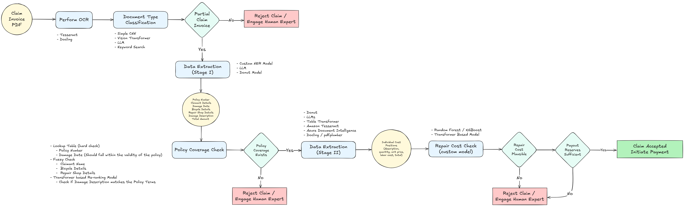

# Claims Handling Pipeline (Mock Implementation)

A proof-of-concept **insurance claims processing pipeline** demonstrating a scalable, queue-based microservices architecture.  
Although implemented as a mock (no real document processing), this project models how such a pipeline could be built in production, focusing on **service decoupling**, **scalability**, and **human-in-the-loop integration**.

---

## 📜 Overview

The pipeline simulates how an insurance claim might be handled end-to-end, from **email ingestion** to **final plausibility checks**.  
Each stage is implemented as an independent **worker service** running in its own Docker container, connected via **Redis queues**.  

The architecture is designed to:

- Scale individual services independently based on load
- Handle failures gracefully via **dead-letter queues**
- Allow **human experts** to pick up and reprocess failed jobs
- Provide **monitoring** through Prometheus and Grafana

---

## 🗺 Pipeline Architecture



---

## 📂 Repository Structure


---

## ✨ Key Features

- **Microservices architecture** — each processing stage runs independently
- **Redis-based message queues** between services
- **Dead-letter queues** for failed jobs after 3 retries
- **Horizontal scalability** — scale bottleneck services independently
- **Human-in-the-loop ready** — manual intervention possible at any stage
- **Basic monitoring** with **Prometheus + Grafana**

---

## 🚀 Getting Started

### 1. Install and set up environment
```
# Install uv (https://docs.astral.sh/uv/getting-started/installation/)

# Create the virtual environment using the uv.lock file and activate it
uv sync
source .venv/bin/activate   # On Windows: .\.venv\Scripts\activate

# Copy the example configuration
cp .env-example .env

```
### 2. Edit the Environment variable
```
# CLAIMS_STORAGE_LOCAL_PATH=/path/to/storage
```

### 3. Start all the services
```
docker-compose up --build
```
### 4. Send mock claim to the email ingestion service

```
python mock_claim_initiation.py --num_samples 10
```

### 5. Monitor the email ingestion service on grafana at http://localhost:3000/

---

## ⚙ How it works

1. **Email Ingestion**: `email-ingestion-service` accepts incoming claim emails (mocked using mock_claim_initiation.py) and pushes it to the `emai-ingestion-queue`.
2. **Email Processing**: `email-processing-worker` read the email from this queue, saved the claim pdf to a claim storage and adds the claim id to the `ocr-queue`
3. **OCR***: `ocr-worker` reads the claim id from the queue, reads the corresponding claim pdf from the claim storage, engages the OCR generating model and stores the OCR output back to the claim storage. After this, the worker adds this claim id to the `document-classifier-queue`.
4. **Document Classification**: `document-classifier-worker` reads the claim id from the queue, uses the OCR output to perform document classification. And places the claim id in either `data-extraction-queue` if the document type is partial claim, otherwise it places in the `claim-rejection-queue`.
5. **Data Extraction**: `data-extraction-worker` reads the claim id from the queue, runs a data extraction model, and saves the output again in the claim storage. The claim id is then added in the `policy-coverage-check-queue`.
6. **Policy Coverage Check**: `policy-coverage-check-worker` reads the claim id from the queue, verifies the policy, and either puts the claim in `table-extraction-queue` or `rejection-queue`. 
7. **Table extraction**: `table-extraction-worker` reads the claim id from the queue, extracts the tables and places them in the claim storage or a DB, and then adds the claim to the `plausibility-check-queue`.
8. **Case Plausibility Check**: `plausibility-check-worker` reads the claim id from the queue, uses some custom models to check for plausibility, and depending on the result, either place the claim on the `claim-acceptance-queue` or the `claim-rejection-queue`
9. **Monitoring via Grafana dashboard**: the `email-ingestion-service` can be monitored using a provided grafana dashboard.

---

## 📌 Notes & Limitations

This repository is a mock of a claims handling platform. no processes are actually implemented — workers are placeholders that simulate behavior.

A dummy PDF claim exists in assets/ for quick demo.

The project is intended to illustrate architecture and operational choices, not to be production-ready.

---

## 📄 License

This repository is a personal project created for demonstration purposes. It contains no proprietary code, data, or confidential information from any employer. Any resemblance to existing systems is coincidental, and all content is my own original work.